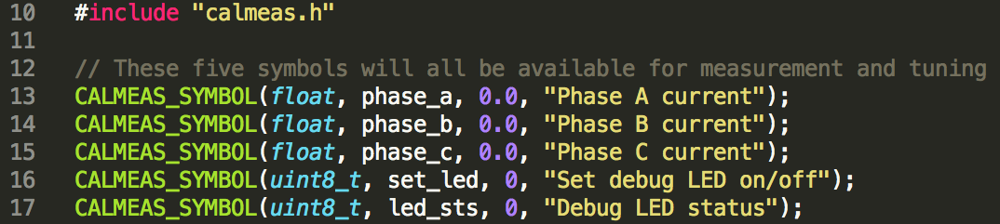
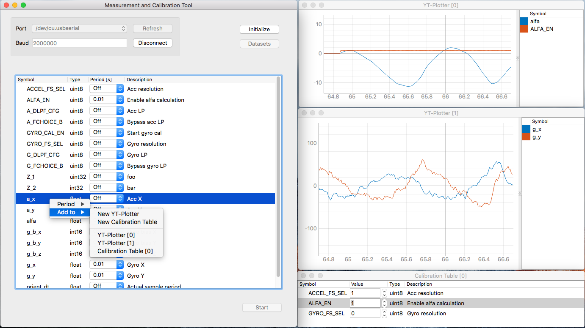

calmeas
=========================== 

A [Calibration and Measurement Tool](https://hackaday.io/project/11607-calibration-and-measurement-tool) for embedded systems

Feeling silly having to re-compile and flash your device for the 11th time just because you want to change that P-gain from 1 to 1.5? You should. 

Ever wanted to real-time plot variables in your embedded application? 

Tired of hacking together yet another ad-hoc serial printer in order to log data to a file?

## The Problem

The issues presented above are not uncommon when developing e.g. embedded control systems. Often you quickly want to figure out if the chosen control strategy is adequate for the problem at hand. And you probably want to find the most appropriate values of the controller parameters.

## The Solution

This project provides a solution to shorten the development loops in such cases by enabling real-time parameter tuning and variable measurements. Simply put, you can tune your controller while at the same time see the system response.

### Features
* Real-time measurement and tuning of variables and parameters
* Desktop application written in Python (PyQt)
* Good looking plots (thank you pyqtgraph!)
* Easy to add custom visualization widgets
* Commands and data is transferred between target and desktop via a USB-to-serial adapter, but the protocol is easy to port to other methods of communication as well, e.g. Bluetooth, CAN, wifi...
* Save parameter data sets
* Very simple variable declaration macros in target code: 

